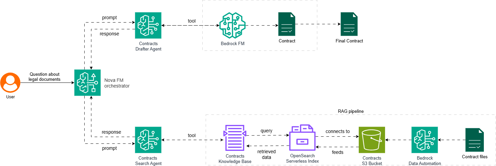

## *This is a work in progress*

## 1. Project description
The project implements an autonomous legal research and drafting agent leveraging AWS-native AI services.
The system can:
* research legal contracts;
* extract and rank relevant clauses and precedents;
* draft structured memos, summaries, or contract redlines;
* perform automated contract review for assignment restrictions, termination clauses, indemnities, and more;
* operate in autonomous or human-in-the-loop mode with escalation for ambiguous cases.

**Key technologies**: 
  * Amazon Bedrock (Nova, AgentCore);
  * Amazon SageMaker, OpenSearch with vector search, Amazon Q, and the CUAD dataset for fine-tuning.

## 2. Project structure 

* [arch](./arch/) - folder containing architectural diagrams.
* [data](./data/) - data folder.
  * [clause_compliance_llm_prompt.txt](./data/clause_compliance_llm_prompt.txt) - LLM prompt used for retrieving compliance review from LLM model acting as a legal AI assistant.
  * [policies.json](./data/policies.json) - various policies used to verify compliance of clauses.
* [iac](./iac/) - AWS CDK IaC folder.
  * [custom_constructs](./iac/custom_constructs/) - custom AWS CDK definitions of AWS infrastructure components.
    * [buckets.py](./iac/custom_constructs/buckets.py) - S3 buckets definitions.
    * [ec2_cuad_preprocessing.py](./iac/custom_constructs/ec2_cuad_preprocessing.py) - EC2 CUAD annotations processing and transformation instance definition.
    * [vpc]
  * [policies](./iac/policies/) - AWS IAM policies required for CDK bootstraping and creating and running of AWS CDK infrastructure components.
    * [cdk_bootstrap_permissions_template.json](./iac/policies/cdk_bootstrap_permissions_template.json) - a template of IAM policy with permissions required for bootstrapping, contains placeholders for region and account ID.
    * [ec2_to_s3_cuad_processing_permissions.json](./iac/policies/ec2_to_s3_cuad_processing_permissions.json) - IAM policy that is added to a role attached to the EC2 instance that is running CUAD annotations processing and transformation.
    * [vpc_management.json](./iac/policies/vpc_management.json) - IAM policy attached to the AWS user account running the CDK deployments.
  * [stacks](./iac/stacks/) - different AWS CDK stacks.
    * [app_stack.py](./iac/stacks/app_stack.py) - the application stack definition.
    * [cuad_processing_stack.py](./iac/stacks/cuad_processing_stack.py) - the CUAD annotations processing stack definition.
    * [vpc_stack](./iac/stacks/vpc_stack.py) - the application VPC stack definition.
  * [tests](./iac/tests/) - unit tests.
  * [user_data](./iac/user_data/) - scripts that need to run every time on EC2 instance start or reboot event.
    * [ec2_instance_bootstrap.sh](./iac/user_data/ec2_instance_bootstrap.sh) - user data for the  EC2 instance for CUAD annotations processing.
  * [app.py](./iac/app.py) - the main script of the IaC project, used to setup all stacks;
  * [iac_config](./iac/iac_config.py) - shared constants used in the IaC project.
* [src](./src/) - the application source code.
  * [config.py](./src/config.py) - shared constants used in the application project.
  * [cuad_chunker.py](./src/cuad_chunker.py) - extracts annotations related to a single contract from the main CUAD_v1.json file into a separate file.
  * [data_provider.py](./src/data_provider.py) - used for loading and storing contracts from/to a local file system or S3 location.
  * [logging_config](./src/logging_config.py) - shared constants specifically used for configuring logger.
  * [transform_cuad.py](./src/transform_cuad.py) - augments the chunked CUAD annotations with additions field and stores them into a separate folder.

## 3. Architecture

The project integrates multiple AWS services:
* **Amazon S3** - raw contracts, CUAD dataset, model artifacts;
* **Amazon Textract** - extract text from PDFs;
* Amazon SageMaker - fine-tuning & hosting embedding model
* **Amazon Bedrock Knowledge Bases** - supports an end-to-end RAG workflow;
* **OpenSearch (vector)** - custom search logic or hybrid retrieval, custom indexing, ranking and filtering;
* **Amazon Bedrock AgentCore** - deploying and scaling dynamic AI agents and tools;
*  **Amazon Bedrock Nova** - reasoning LLM for drafting/explanations;
*  **Amazon Q** - front-end for users interaction;
* **AWS Step Functions**  optional workflow including human-in-the-loop review.

<br/>

## 4. Agentic workflow

The workflow includes following steps:

1. **Ingestion**: Contracts uploaded to S3 → Textract → chunked into clauses.
2. **Indexing**: Clauses embedded via SageMaker endpoint → vectors stored in OpenSearch.
3. **Query**: User asks a legal question via Amazon Q (or API).
4. **Retrieval**: AgentCore retrieves top-k relevant clauses.
5. **Reasoning**: Nova LLM synthesizes answer, cites sources, drafts clauses or memos.
6. **Validation**: Confidence thresholds decide auto-response vs escalation to human review.
7. **Storage**: Contract saved in S3, optionally contract's metadata could be stored in Amazon Bedrock Knowledge Bases.

## 5. The training process

## 6. Data annotations

The [CUAD](https://www.atticusprojectai.org/cuad) dataset is used for the QnA and the draft/review LLM models training.
Before training the models the CUAD dataset entries are converted from the SQuAD format into a custom data format.
For an example data annotation entry in the original CUAD dataset:
```
{
  "answers": [
    {"text": "Distributor","answer_start": 244},
    {"text": "Electric City Corp.", "answer_start": 148},
    {"text": "Electric City of Illinois L.L.C.", "answer_start": 49574},
    {"text": "Company", "answer_start": 197},
    {"text": "Electric City of Illinois LLC", "answer_start": 212}
  ],
  "id": "LIMEENERGYCO_09_09_1999-EX-10-DISTRIBUTOR AGREEMENT__Parties",
  "question": "Highlight the parts (if any) of this contract related to \"Parties\" that should be reviewed by a lawyer. Details: The two or more parties who signed the contract",
  "is_impossible": false
  }
```
is converted into:
```
{
  "contract_id": "LIMEENERGYCO_09_09_1999-EX-10-DISTRIBUTOR AGREEMENT",
  "clause_text": [
    "Distributor",
    "Electric City Corp.",
    "Electric City of Illinois L.L.C."
  ],
  "clause_type": "Parties",
  "annotations": {
    "review_label": "Risky",
    "policy_context": {
      "policy_id": "P-01",
      "policy_text": "All contracting parties must be identified with consistent legal entity names as registered in the Secretary of State records."
    },
    "suggested_redline": "The Parties to this Agreement are Electric City Corp. and Electric City of Illinois L.L.C., as registered legal entities.",
    "rationale": "Clause lists inconsistent naming ('LLC' vs 'L.L.C.'). Policy requires exact Secretary of State names."
  }
}
```
To start the transformation process, run the **transform_cuad_s3.py**(./src/transform_cuad_s3.py) CUAD transformation script:
```
python ./transform_cuad_s3.py -c PATH_TO_THE_FOLDER_WITH_CHUNKED_CUAD_ANNOTS -o PATH_TO_THE_FOLDER_WITH_TRANSFORMED_CUAD_ANNOTS -p PATH_TO_POLICIES_FILE -f PATH_TO_THE_FOLDER_WITH_CONTRACTS_TEXT
```
> The path to folders containing CUAD data and policies can be either a path on a local file system or AWS S3 bucket path.

## 7. Prerequisities

## 8. Infrastructure as code

## 9. Running the app

## 10. Running the unit tests

