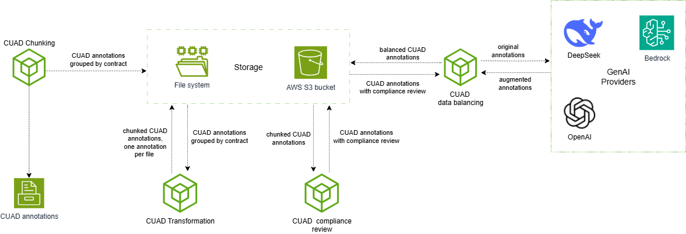

## *This is a work in progress*

## 1. Project description
The project implements an autonomous legal research and drafting agent leveraging AWS-native AI services.
The system can:
* research legal contracts;
* extract and rank relevant clauses and precedents;
* draft structured memos, summaries, or contract redlines;
* perform automated contract review for assignment restrictions, termination clauses, indemnities, and more;
* operate in autonomous or human-in-the-loop mode with escalation for ambiguous cases.

**Key technologies**: 
  * Amazon Bedrock (Nova, AgentCore);
  * Amazon SageMaker, OpenSearch with vector search, Amazon Q, and the CUAD dataset for fine-tuning.

## 2. Project structure 

* [arch](./arch/) - folder containing architectural diagrams.
* [data](./data/) - data folder.
  * [templates](./data/templates/) - folder containing various LLM prompt templates.
    * [amazon_nova_evaluation_system_role_prompt.txt](./data/templates/amazon_nova_evaluation_system_role_prompt.txt) - prompt template used for Bedrock batch inference.
    * [bedrock_model_evaluation_custom_metrics_prompt.txt](./data/templates/bedrock_model_evaluation_custom_metrics_prompt.txt) - a custom template used by a judge model during Bedrock model evaluation.
  * [clause_augmentation_llm_prompt_template.yml](./data/clause_augmentation_llm_prompt_template.yml) - LLM prompt template used for augmenting annotations of different clause types. 
  * [clause_compliance_llm_prompt_template.yml](./data/clause_compliance_llm_prompt_template.yml) - LLM prompt template used for retrieving compliance review from LLM model acting as a legal AI assistant.
  * [lack_of_required_data_llm_prompt_template.yml](./data/lack_of_required_data_llm_prompt_template.yml) - LLM prompt template used specifically for augmenting annotations with the "Lack of required data" review label.
  * [missing_clause_augmentation_llm_prompt_template.yml](./data/missing_clause_augmentation_llm_prompt_template.yml) - LLM prompt template used specifically for augmenting annotations with the "Missing" review label. 
  * [policies.json](./data/policies.json) - various policies used to verify compliance of clauses.
  * [rephrase_text_llm_prompt_template.yml](./data/rephrase_text_llm_prompt_template.yml) - LLM prompt template used for generating variations of the input phrases.
   [risky_llm_prompt_template.yml](./data/risky_llm_prompt_template.yml) - LLM prompt template used specifically for augmenting annotations with the "Risky" review label. 
* [iac](./iac/) - AWS CDK IaC folder.
  * [custom_constructs](./iac/custom_constructs/) - custom AWS CDK definitions of AWS infrastructure components.
    * [ec2_cuad_preprocessing.py](./iac/custom_constructs/ec2_cuad_preprocessing.py) - EC2 CUAD annotations processing and transformation instance definition.
    * [storage.py](./iac/custom_constructs/storage.py) - storage related components definitions such as S3 buckets.
  * [policies](./iac/policies/) - AWS IAM policies required for CDK bootstraping and creating and running of AWS CDK infrastructure components.
    * [bedrock_batch_inference_service_role_template.json](./iac/policies/bedrock_batch_inference_service_role_template.json) - a template of the IAM policy containing permissions required for creating and running batch inference jobs in Bedrock.
    * [bedrock_batch_inference_submitter_template.json](./iac/policies/bedrock_batch_inference_submitter_template.json) - a template of the IAM policy containing permissions required for submitting requests for batch inference jobs creation in Bedrock.
    * [bedrock_model_as_judge_evaluation_template.json](./iac/policies/bedrock_model_as_judge_evaluation_template.json) -
    a template of the IAM policy containing permissions required for creating and running the Model-as-Judge automated evaluation jobs in Bedrock.
    * [cdk_bootstrap_permissions_template.json](./iac/policies/cdk_bootstrap_permissions_template.json) - a template of the IAM policy containing permissions required for bootstrapping, contains placeholders for region and account ID.
    * [ec2_to_s3_cuad_processing_permissions.json](./iac/policies/ec2_to_s3_cuad_processing_permissions.json) - IAM policy that is added to a role attached to the EC2 instance that is running CUAD annotations processing and transformation.
    * [vpc_management.json](./iac/policies/vpc_management.json) - IAM policy attached to the AWS user account running the CDK deployments.
  * [stacks](./iac/stacks/) - different AWS CDK stacks.
    * [app_stack.py](./iac/stacks/app_stack.py) - the application stack definition.
    * [cuad_processing_stack.py](./iac/stacks/cuad_processing_stack.py) - the CUAD annotations processing stack definition.
    * [bedrock_batch_iam_stack.py](./iac/stacks/bedrock_batch_iam_stack.py) - the stack containing IAM components definitions related to creating and running batch inference jobs in Bedrock.
    * [bedrock_evaluation_iam_stack.py](./iac/stacks/bedrock_evaluation_iam_stack.py) - the stack containing IAM components definitions related to creating and running models evaluation jobs in Bedrock.
    * [storage_stack](./iac/stacks/storage_stack.py) - the stack containing the storage related components definitions.
    * [vpc_stack](./iac/stacks/vpc_stack.py) - the application VPC stack definition.
  * [tests](./iac/tests/) - unit tests.
  * [user_data](./iac/user_data/) - scripts that need to run every time on EC2 instance start or reboot event.
    * [ec2_instance_bootstrap.sh](./iac/user_data/ec2_instance_bootstrap.sh) - user data for the  EC2 instance for CUAD annotations processing.
  * [utilities](./iac/utilities/) - IaC utilities
    * [permissions.py](./iac/utilities/permissions.py) - utility functions for creating IAM roles and policies from templates.
  * [app.py](./iac/app.py) - the main script of the IaC project, used to setup all stacks;
  * [iac_config](./iac/iac_config.py) - shared constants used in the IaC project.
* [juristiq](./juristiq/) - the application source code.
  * [cloud](./juristiq/cloud/) - cloud related modules.
    * [utils.py](./juristiq/cloud/utils.py) - utility functions for creating various boto3 clients.
  * [config](./juristiq/config/) - configuration files.
    * [cloud.py](./juristiq/config/cloud.py) - constants used mostly when creating boto3 clients.
    * [common.py](./juristiq/config/common.py) - constants used by other configuration files.
    * [consts.py](./juristiq/config/consts.py) - shared constants used in the application project.
    * [inference.py](./juristiq/config/inference.py) - constants related to running model inference in Bedrock.
    * [logging_config](./juristiq/config/logging_config.py) - shared constants and utility scripts specifically used for configuring the logger.
    * [templates.py](./juristiq/config/templates.py) - shared constants related to LLM prompt templates.
  * [data_augmentation](./juristiq/data_augmentation/) - data augmentation utilities.
    * [remote_paraphraser.py](./juristiq/data_augmentation/remote_paraphraser.py) - runs data augmentation using third-party GenAI providers.
  * [data_preprocessing](./juristiq/data_preprocessing/) - data preprocessing utilities.
    * [llm_fine_tuning](./juristiq/data_preprocessing/llm_fine_tuning/) - LLM fune tuning related data preprocessing utilities.
      * [titan_compatible_jsonl.py](./juristiq/data_preprocessing/llm_fine_tuning/titan_compatible_jsonl.py) - creates dataset in a format compatible with the Amazon Titan generative AI models.
    * [annots.py](./juristiq/data_preprocessing/annots.py) - utility functions for working with annotation samples.
    * [cuad_chunker.py](./juristiq/data_preprocessing/cuad_chunker.py) - extracts annotations related to a single contract from the main CUAD_v1.json file into a separate file.
    * [cuad_dataset_balancer.py](./juristiq/data_preprocessing/cuad_dataset_balancer.py) - produces the balanced dataset.
    * [data_providers.py](./juristiq/data_preprocessing/data_provider.py) - used for loading and storing contracts from/to a local file system or S3 location.
    * [review_cuad](./juristiq/data_preprocessing/review_cuad.py) - runs comliance review on each contract clause annotation using LLM.
    * [transform_cuad.py](./juristiq/data_preprocessing/transform_cuad.py) - augments the chunked CUAD annotations with additions field and stores them into a separate folder.
    * [utils.py](./juristiq/data_preprocessing/data_utils.py) - various data utilities.
  * [experiments] - experimental code, not used
  * [file](./juristiq/file/) - file utilities
    * [utils.py](./juristiq/file/utils.py) - utilities for writting text to files.
  * [genai](./juristiq/genai/) - GenAI utilities.
    * [clients.py](./juristiq/genai/clients.py) - adapters for different GenAI providers.
    * [config.py](./juristiq/genai/config.py) - GenAI configuration settings.
    * [exceptions.py](./juristiq/genai/exceptions.py) - custom exceptions triggered by GenAI adapters.
    * [output_parsers.py](./juristiq/genai/output_parsers.py) - different GenAI output parsers.
    * [utils.py](./juristiq/genai/utils.py) - utility functions used with the GenAI adapters.
  * [inference](./juristiq/inference/) - inference utilities.
    * [models.py](./juristiq/inference/models.py) - contains enumeration of models used for running on-demand and batch inference and evaluation jobs in AWS Bedrock.
    * [prompts.py](./juristiq/inference/prompts.py) - utility scripts for constructing LLM prompts.
    * [tokens_counter.py](./juristiq/inference/tokens_counter.py) - tokens counting utility. 
  * [llm](./juristiq/llm/) - LLM utilities.
    * [utils.py](./juristiq/llm/utils.py) - utility functions used for creation of various LLM prompts, mostly used for data augmentation.
  * [monitoring](./juristiq/monitoring/) - infrastructure and costs monitoring utilities
    * [bedrock.py](./juristiq/monitoring/bedrock.py) - utility function for monitoring input and output tokens for different LLMs.
    * [costs_calculator.py](./juristiq/monitoring/costs_calculator.py) - a simply utility for calculating total 
    costs based on the number of input and output tokens.
* [scripts](./scripts/) - standalone scripts.
  * [llm_fine_tuning](./scripts/llm_fine_tuning/) - scripts for running data preprocessing, fine-tuning and models evaluation.
    * [create_batch_inference_dataset.py](./scripts/llm_fine_tuning/create_batch_inference_dataset.py) - creates a dataset containing prompts in a format required for running batch inference jobs in AWS Bedrock.
    * [create_batch_inference_evaluation_dataset.py](./scripts/llm_fine_tuning/create_batch_inference_evaluation_dataset) - creates a dataset containing prompts in a format required for running the evaluation of the batch inference results in AWS Bedrock.
    * [create_batch_inference_job.py](./scripts/llm_fine_tuning/create_batch_inference_job.py) - submits a new batch inference job request to AWS Bedrock.
    * [create_model_as_judge_evaluation_dataset.py](./scripts/llm_fine_tuning/create_model_as_judge_evaluation_dataset.py) - creates a dataset containing prompts in a format required for running Model-as-Judge evaluation jobs in AWS Bedrock.
    * [evaluate_model_inference.py](./scripts/llm_fine_tuning/evaluate_model_inference.py) - submits a new model evaluation job request to AWS Bedrock.
    * [inference_costs_calculator.py](./scripts/llm_fine_tuning/inference_costs_calculator.py) - runs inference costs estimation.
    * [train_token_estimator.py (**NOT USED**)](./scripts/llm_fine_tuning/train_token_estimator.py) - trains a linear regression model for the prediction of the number of tokens per text, for models that do not have publicly available tokenizers, such as Amazon Nova Lite. 
  * [create_stratified_dataset.py](./scripts/create_stratified_dataset.py) - creates a stratified dataset.
  * [cuad_dataset_balancing.py](./scripts/cuad_dataset_balancing.py) - runs the dataset balancing process.
  
## 3. Architecture

The project integrates multiple AWS services:
* **Amazon S3** - raw contracts, CUAD dataset, model artifacts;
* **Amazon Textract** - extract text from PDFs;
* Amazon SageMaker - fine-tuning & hosting embedding model
* **Amazon Bedrock Knowledge Bases** - supports an end-to-end RAG workflow;
* **OpenSearch (vector)** - custom search logic or hybrid retrieval, custom indexing, ranking and filtering;
* **Amazon Bedrock AgentCore** - deploying and scaling dynamic AI agents and tools;
*  **Amazon Bedrock Nova** - reasoning LLM for drafting/explanations;
*  **Amazon Q** - front-end for users interaction;
* **AWS Step Functions**  optional workflow including human-in-the-loop review.

<br/>

## 4. Agentic workflow

The workflow includes following steps:

1. **Ingestion**: Contracts uploaded to S3 → Textract → chunked into clauses.
2. **Indexing**: Clauses embedded via SageMaker endpoint → vectors stored in OpenSearch.
3. **Query**: User asks a legal question via Amazon Q (or API).
4. **Retrieval**: AgentCore retrieves top-k relevant clauses.
5. **Reasoning**: Nova LLM synthesizes answer, cites sources, drafts clauses or memos.
6. **Validation**: Confidence thresholds decide auto-response vs escalation to human review.
7. **Storage**: Contract saved in S3, optionally contract's metadata could be stored in Amazon Bedrock Knowledge Bases.

## 5. The training process

## 6. Data annotations

The [CUAD](https://www.atticusprojectai.org/cuad) dataset is used for the QnA and the draft/review LLM models training.
Before training the models the CUAD dataset entries are converted from the SQuAD format into a custom data format.
For an example data annotation entry in the original CUAD dataset:
```
{
  "answers": [
    {"text": "Distributor","answer_start": 244},
    {"text": "Electric City Corp.", "answer_start": 148},
    {"text": "Electric City of Illinois L.L.C.", "answer_start": 49574},
    {"text": "Company", "answer_start": 197},
    {"text": "Electric City of Illinois LLC", "answer_start": 212}
  ],
  "id": "LIMEENERGYCO_09_09_1999-EX-10-DISTRIBUTOR AGREEMENT__Parties",
  "question": "Highlight the parts (if any) of this contract related to \"Parties\" that should be reviewed by a lawyer. Details: The two or more parties who signed the contract",
  "is_impossible": false
  }
```
is converted into:
```
{
  "contract_id": "LIMEENERGYCO_09_09_1999-EX-10-DISTRIBUTOR AGREEMENT",
  "clause_text": [
    "Distributor",
    "Electric City Corp.",
    "Electric City of Illinois L.L.C."
  ],
  "clause_type": "Parties",
  "annotations": {
    "review_label": "Risky",
    "policy_context": {
      "policy_id": "P-01",
      "policy_text": "All contracting parties must be identified with consistent legal entity names as registered in the Secretary of State records."
    },
    "suggested_redline": "The Parties to this Agreement are Electric City Corp. and Electric City of Illinois L.L.C., as registered legal entities.",
    "rationale": "Clause lists inconsistent naming ('LLC' vs 'L.L.C.'). Policy requires exact Secretary of State names."
  }
}
```
To start the transformation process, run the **transform_cuad_s3.py**(./juristiq/transform_cuad_s3.py) CUAD transformation script:
```
python ./transform_cuad_s3.py -c PATH_TO_THE_FOLDER_WITH_CHUNKED_CUAD_ANNOTS -o PATH_TO_THE_FOLDER_WITH_TRANSFORMED_CUAD_ANNOTS -p PATH_TO_POLICIES_FILE -f PATH_TO_THE_FOLDER_WITH_CONTRACTS_TEXT
```
> The path to folders containing CUAD data and policies can be either a path on a local file system or AWS S3 bucket path.

## 7. Data preprocessing

The CUAD data preprocessing is divided into the following phases:
1. **CUAD chunking** - the original CUAD annotations are extracted into separate files grouped by the contract names.
2. **CUAD transformation** - each chunked annotation file is further split into separate files, one file per annotation sample.
3. **CUAD compliance review** - the compliance review is run on each annotation sample and the compliance review values, such as the "Rationale" and the "Suggested Redline", are automatically generated using GenAI.
4. **CUAD dataset balancing** - a balanced dataset is created based on specified percentage of different clause types.

<br/>

### 7.1. CUAD dataset balancing

The CUAD dataset balancing can be started by running the **juristiq/scripts/cuad_data_balancing.py** script.

## 8. Model fine-tuning

Before fine-tuning the draft/review LLM model, the baseline metrics need to be calculated.
These metrics are caculated on the test subset of the dataset that will be used for fine-tuning.

> Before running the batch inference job the following IAM permissions need to be set first:
>  1. Permissions for an IAM identity to submit and manage batch inference jobs.


## 9. Model evaluation

## 10. Prerequisities

## 11. Infrastructure as code

## 12. Running the app

### 12.1. Running the scripts, in the "juristiq/scripts" folder, from withing VS Code

In order to run the scripts, in the **juristiq/scripts** folder, the following line needs to be added to the **"configurations"** elements inside the **.vscode/launch.json** file:
```json
"env": { "PYTHONPATH": "${workspaceFolder}" }
```

### 12.2 The scripts folder

The **juristiq/scripts** folder contains useful utility scripts that could be used for use cases
from the CUAD data preprocessing to the LLM fine-tuning and evaluation:

> All scripts should be run from the project's root folder.


1. Creating a stratified dataset split into the training, validation and the testing subsets:
```bash
python -m scripts.dataset_stratified_split_jsonl -a PATH_TO_THE_BALANCED_ANNOTATIONS_FOLDERS -o OUTPUT_FOLDER_PATH
```

2. Creating a dataset for batch inference
```bash
python -m scripts.llm_fine_tuning.create_batch_inference_dataset -a JSONL_FILE_PATH -o PATH_TO_OUTPUT_FOLDER
```

## 13. Running the unit tests

